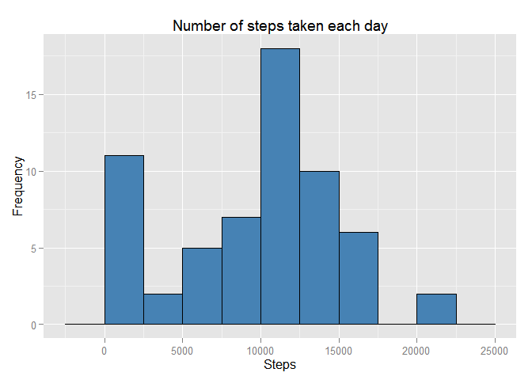
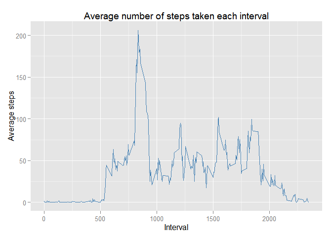
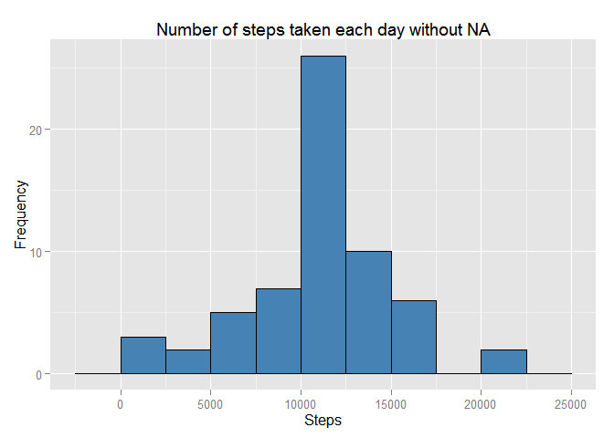
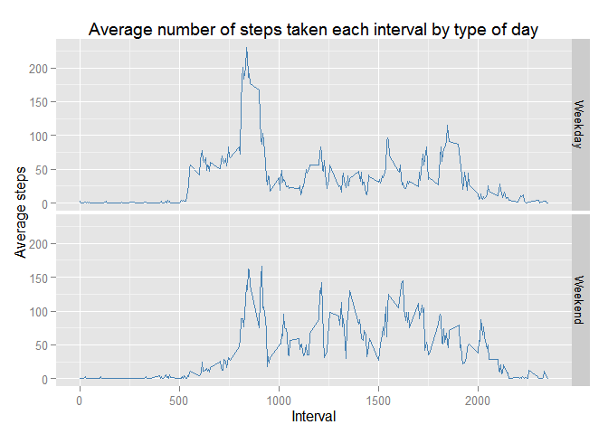

# Reproducible Research: Peer Assessment 1
Morozov Gleb  
Saturday, April 18, 2015  


## Loading and preprocessing the data


```r
library(ggplot2)
library(dplyr)
```

### Reading the dataset


```r
Sys.setlocale(locale = "us")
unzip("activity.zip")
data <- read.csv("activity.csv", stringsAsFactors = F)
data$date <- as.Date(data$date, format = "%Y-%m-%d")
```

### Dataset sample


```r
head(data)
```

```
##   steps       date interval
## 1    NA 2012-10-01        0
## 2    NA 2012-10-01        5
## 3    NA 2012-10-01       10
## 4    NA 2012-10-01       15
## 5    NA 2012-10-01       20
## 6    NA 2012-10-01       25
```


## What is mean total number of steps taken per day?


```r
total.step <- data %>% group_by(date) %>% summarise(sumstep = sum(steps, na.rm = T))
qplot(data = total.step, x = sumstep, geom = "histogram", binwidth = 2500, 
      fill = I("steelblue"), colour = I("black")) +
        labs(title = "Number of steps taken each day", x = "Steps", y = "Frequency")
```

 

Mean of the total number of steps taken per day


```r
mean(total.step$sumstep)
```

```
## [1] 9354.23
```

Median of the total number of steps taken per day

```r
median(total.step$sumstep)
```

```
## [1] 10395
```


## What is the average daily activity pattern?


```r
avg.step <- data %>% group_by(interval) %>% summarise(avgstep = mean(steps, na.rm = T))
qplot(data = avg.step, interval, avgstep, geom = "line", colour = I("steelblue")) +
        labs(title = "Average number of steps taken each interval", x = "Interval", y = "Average steps")
```

 

###5-minute interval with the maximum number of steps

```r
filter(avg.step, avgstep == max(avgstep))$interval
```

```
## [1] 835
```


## Imputing missing values

###Total number of missing values in the dataset

```r
sum(is.na(data$steps))
```

```
## [1] 2304
```

###Replacing all NA steps values with the average value in the according interval

```r
data.fillna <- data
for (i in 1:length(data.fillna$steps)) {
        if (is.na(data.fillna$steps[i])) {
                data.fillna$steps[i] <- filter(avg.step, interval == 
                                                       data.fillna$interval[i])$avgstep
        }
}
```

### Updated steps histogram

```r
total.step.fillna <- data.fillna %>% group_by(date) %>% summarise(sumstep = sum(steps, na.rm = T))
qplot(data = total.step.fillna, x = sumstep, geom = "histogram", binwidth = 2500, 
      fill = I("steelblue"), colour = I("black")) +
        labs(title = "Number of steps taken each day without NA", x = "Steps", y = "Frequency")
```

 

Mean of the total number of steps taken per day

```r
mean(total.step.fillna$sumstep)
```

```
## [1] 10766.19
```

Median of the total number of steps taken per day

```r
median(total.step.fillna$sumstep)
```

```
## [1] 10766.19
```


## Are there differences in activity patterns between weekdays and weekends?

```r
data.fillna <- mutate(data.fillna, date = weekdays(date))
for (i in 1:length(data.fillna$date)) {
        if ((data.fillna$date[i] == "Saturday") | (data.fillna$date[i] == "Sunday")) {
                data.fillna$date[i] <- "Weekend"}
        else data.fillna$date[i]  <- "Weekday"
}

data.fillna %>% group_by(date, interval) %>% summarise(avgstep = mean(steps)) %>% 
        qplot(data = ., interval, avgstep, geom = "line", facets = date ~ ., 
              colour = I("steelblue")) + 
        labs(title = "Average number of steps taken each interval by type of day",
             x = "Interval", y = "Average steps")
```

 

